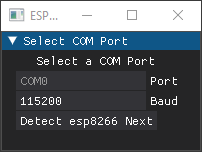

# esp8266-otp

## Project Overview

The `esp8266-otp` project leverages the ESP8266 microcontroller to function as a TOTP (Time-based One-Time Password) token, allowing users to manage and update tokens through a dedicated application. This setup includes an OLED display and buttons for user interaction, offering a convenient and secure method for generating and managing OTPs.


## Getting Started

### Prerequisites

- ESP8266 development board
- OLED display compatible with Adafruit SSD1306
- Buttons for user input
- Required Python libraries: `serial`, `dearpygui`, `json`, `base64`

### Installation

1. **ESP8266 Setup**: Flash the `esp-otp.ino` code onto your ESP8266 board. Ensure that the necessary libraries (`FS`, `LittleFS`, `ArduinoJson`, `ESP8266WiFi`, `Adafruit_GFX`, `Adafruit_SSD1306`, `TOTP`, `sha1`, `SPI`, `Wire`) are installed.

2. **Python Application**: Install the required Python libraries:
   ```sh
   pip install pyserial dearpygui
   ```

3. **Run the Application**: Execute the Python script to start the configuration script:
   ```sh
   python main.py
   ```

### Configuration

1. **Select COM Port**: Use the application to detect and select the appropriate COM port for the ESP8266.
   
   
2. **Enter Master PIN**: Input the master PIN to authenticate and access the main management interface.
   
   
3. **Manage Tokens**: Add, delete, or refresh TOTP tokens. Update WiFi settings or change the master PIN as needed.
   
   


## Contributions

Feel free to fork the project and submit pull requests. For major changes, please open an issue to discuss what you would like to change.

## License

This project is licensed under the MIT License.

## Contact

For any questions or support, please contact me at telegram @nwsynx.

